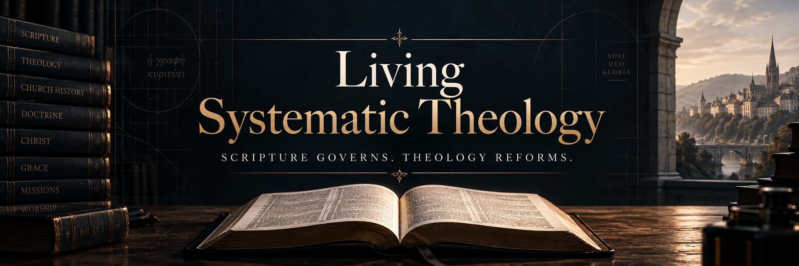

# Living Systematic Theology

  

**A Christ-centered, Scripture-governed, continuously reforming systematic theology**

Living Systematic Theology, or **LST**, is a fallible attempt to state the theology of Scripture as faithfully and accurately as possible.

It is not built around loyalty to Calvinism, Arminianism, Covenant Theology, Dispensationalism, or any other theological camp. Those traditions may contain important truths and important arguments, but none of them is allowed to decide beforehand what Scripture must say.

**Scripture has the final word.**

## The Governing Maxim

> **Living Systematic Theology seeks to state the theology of Scripture as nearly as fallible interpreters can, speaking with the certainty Scripture gives, refusing certainty Scripture does not give, adding nothing the text cannot sustain, and surrendering nothing the text requires us to confess.**

Where Scripture speaks clearly, LST should speak clearly.

Where Scripture does not settle a question, LST should not pretend that it has.

The goal is not caution for its own sake, compromise between theological camps, or a permanent middle position.

The goal is **faithfulness**.

## Start Here

If you are new to Living Systematic Theology, begin with the Creed for a shorter overview of what LST presently teaches.

- **[LST Creed](LST_CREED.md)** — A concise summary of LST's current theological positions and confidence levels.
- **[Living Systematic Theology](LIVING_SYSTEMATIC_THEOLOGY.md)** — The full current systematic theology, including biblical arguments, qualifications, counterevidence, and unresolved questions.
- **[Revision Record](LST_REVISION_RECORD.md)** — The documented history of significant changes to LST, including what changed and why.
- **[Theological Labels Guide](LST_THEOLOGICAL_LABELS_GUIDE.md)** — A quick comparison showing which familiar theological traditions LST most closely resembles in each major area, without making those labels authoritative.
- **[How Challenges and Changes Work](CONTRIBUTING.md)** — How public challenges are examined, how revisions are approved, and how GitHub relates to the private LST working repository.
- **[Challenge Verdict Template](CHALLENGE_VERDICT_TEMPLATE.md)** — The standard public format used to record whether a challenge is sustained, partially sustained, not sustained, or unresolved.

If you believe any current LST position is wrong, overstated, understated, or inadequately demonstrated, open an Issue and choose **Challenge an LST Position**.

## How to Challenge LST

If you believe LST gets something wrong, overstates something, understates something, or has not adequately demonstrated a conclusion, you are invited to challenge it.

Open an Issue and choose **Challenge an LST Position**.

You do not need to write five separate essays. Submit **one coherent biblical argument**, but make sure your challenge gives us these five things:

1. **The exact LST position you are challenging.** Quote it if possible, or identify the doctrine or chapter.
2. **What you believe LST gets wrong.** Explain whether you think it is false, overstated, understated, misunderstood, or insufficiently demonstrated.
3. **Your strongest biblical case.** Give the Scripture passages and explain how they support your challenge.
4. **What you believe LST should say instead.** You do not need perfect wording. State the conclusion you believe Scripture requires.
5. **What would convince you the current LST position should remain.** Make the challenge testable by explaining what biblical evidence or argument would change your mind.

You may bring historical theology, confessions, linguistic research, commentaries, or other supporting material, but those do not replace the biblical case.

**You do not need to be a theologian. You do not need technical language. You do need to show why you believe Scripture requires LST to change.**

Every serious challenge receives a public disposition explaining whether it was **Sustained, Partially Sustained, Not Sustained, or Unresolved**, and whether LST changed as a result.

Challengers may answer on the same issue in up to **three rebuttal rounds**, with **seven days after each adjudication** while rounds remain. A timely rebuttal is examined before closure. If no rebuttal arrives within the window, the current decision becomes final for that challenge; silence is not proof that LST is correct. See [the full rebuttal and closure procedure](CONTRIBUTING.md#rebuttal-windows-and-closure).

Only the **Living Systematic Theology itself** carries the active semantic version number. Supporting governing documents use stable filenames so public links do not become stale when LST advances to a new release.

## Why This Project Exists

Christians have spent centuries studying Scripture, building theological systems, debating difficult passages, preserving important insights, and correcting serious errors.

Living Systematic Theology does not dismiss that history. We stand downstream from an enormous amount of faithful human work.

What has changed is the **scale and speed of the tools now available to us**.

Modern artificial intelligence can search and compare enormous amounts of biblical, linguistic, historical, and theological material. It can place competing interpretations beside one another, locate neglected passages, expose hidden assumptions, trace arguments across Scripture, and deliberately construct strong challenges to an existing theological position in a fraction of the time such work once required.

That creates an opportunity previous generations did not possess.

Not an opportunity to let AI decide theology.

An opportunity to **test theology harder than ever before**.

AI has no theological authority.

Neither does any individual theologian, church tradition, confession, denomination, or version of LST itself.

The authority remains the written Word of God.

LST seeks to use modern tools alongside the accumulated work of the historic Church to subject a systematic theology to continual examination under Scripture.

If a Calvinist, Arminian, Catholic, Orthodox Christian, Lutheran, Baptist, dispensationalist, covenant theologian, scholar, pastor, ordinary believer, skeptic, or AI system can expose an error in LST from Scripture, that challenge deserves to be heard.

If Scripture requires LST to change, **LST should change**.

If a challenge fails after its strongest biblical case has been examined, the existing position should emerge better understood and better defended.

The aim is not to create another theological tribe.

It is to keep asking one question:

> **What did God actually reveal, and how closely can our theology conform to it?**
